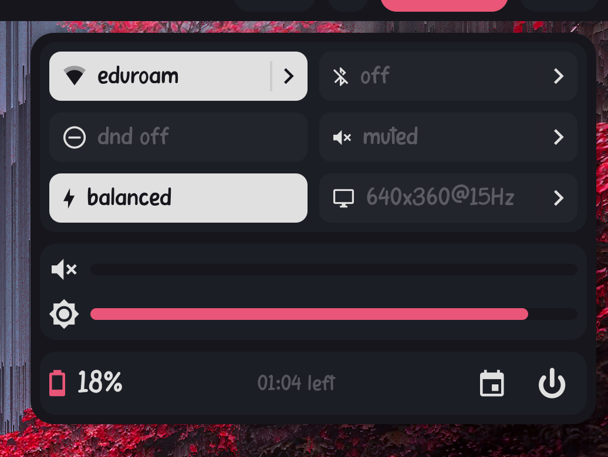
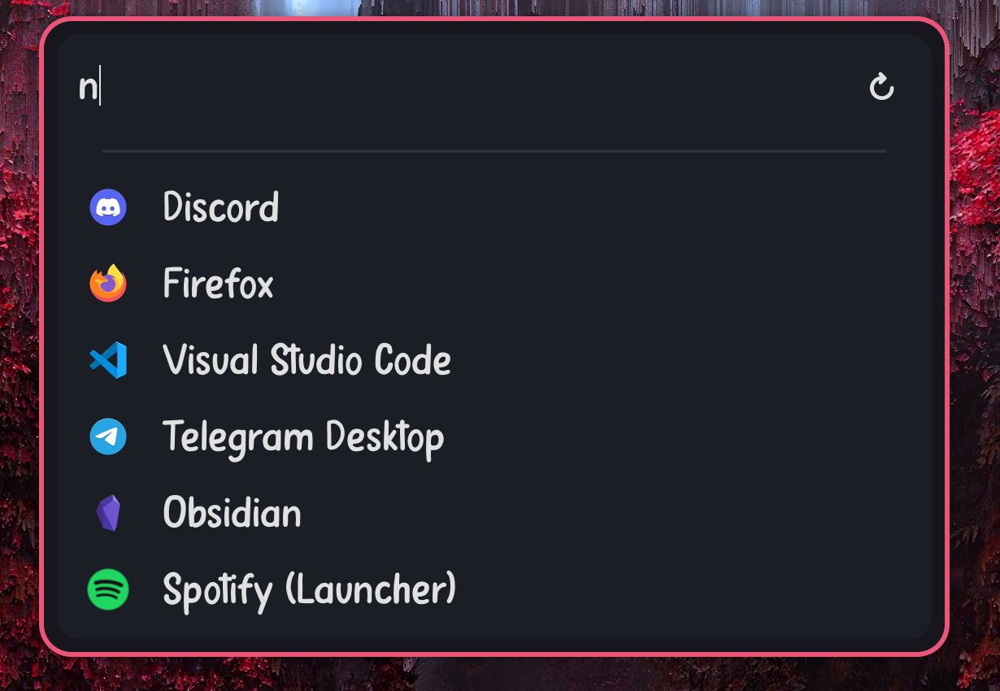

# .dotfiles
These are my linux dotfiles! They contain all my config options for my linux desktop environment that I daily-drive. They are entirely free to use and copy but they are not intended for ease of use or general usage. 

The majority of desktop functionality is written for **astal** in typescript. This exists in the [.config/astal](home/.config/astal/) directory. Feel free to check it out, this is 95% of the desktop config!

## Software used
Here's all the software I use for my desktop:
- **Desktop**:
  - **WM**: [Hyprland](https://github.com/hyprwm/Hyprland)
  - **Desktop environment**: Custom using [Astal](https://github.com/Aylur/Astal) & [AGS](https://github.com/Aylur/ags)
  - **Lockscreen**: [Hyprlock](https://github.com/hyprwm/hyprlock/)
  - **Wallpapers**: [SWWW](https://github.com/LGFae/swww)
- **My programs**:
  - **File manager**: [Nemo](https://github.com/linuxmint/nemo)
  - **Terminal**: [Foot](https://codeberg.org/dnkl/foot)
  - **Terminal text editor**: [Neovim](https://github.com/neovim/neovim)
  - **Terminal file manager**: [lf](https://github.com/gokcehan/lf)
- **Theme management**: [Pywal](https://github.com/dylanaraps/pywal)
- **Shell**: zsh

## Installation
Installation occurs by running the [apply.sh](apply.sh) file but this deals with symlinks and overwriting files. **Please read the script before you run it**, it was not written with general usage in mind and *I'm not responsible for any borked or deleted files*.

You can tweak which files are actually applied in your system and how they are applied by tweaking the [targets.json](targets.json) file. Remove the targets you don't want applied.

## Screenshots

    
    

    
    

## License
My dotfiles are licensed under the **MIT License**. Please see the [LICENSE](LICENSE) document for more details.
