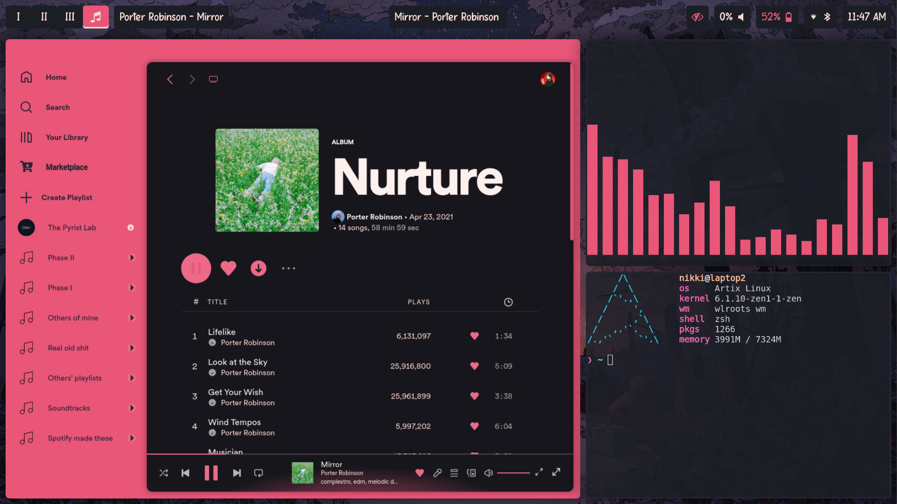
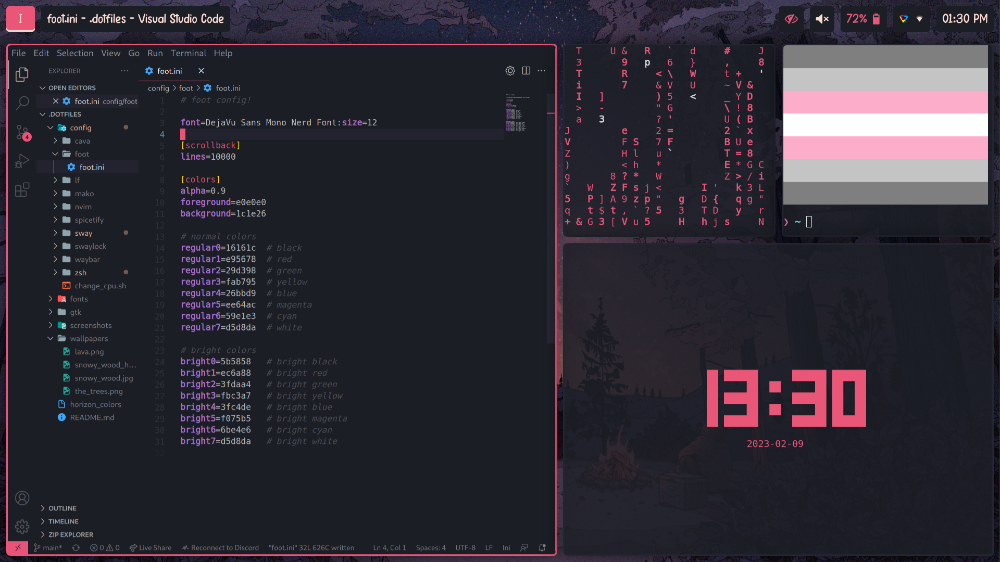

  

<h3 align="center">🖤❤️🤍 Nikki's Dots 🤍❤️🖤</h3>
<h6 align="center">enjoy :]</h6>

---

### Hi!
thanks for checkin out my dotfiles :]

here are the details about my current setup:

 - **WM:** [Sway](https://github.com/swaywm/sway)
 - **OS:** Artix Linux
 - **Terminal:** [Foot](https://codeberg.org/dnkl/foot)
 - **Shell:** Zsh
 - **Launcher:** [Fuzzel](https://codeberg.org/dnkl/fuzzel)
 - **Bar:** [Waybar](https://github.com/Alexays/Waybar)
 - **Notifs:** [Mako](https://github.com/emersion/mako)
 - **File Manager(s):** [LF](https://github.com/gokcehan/lf) & [Thunar](https://git.xfce.org/xfce/thunar/)

---

### Screenshots

